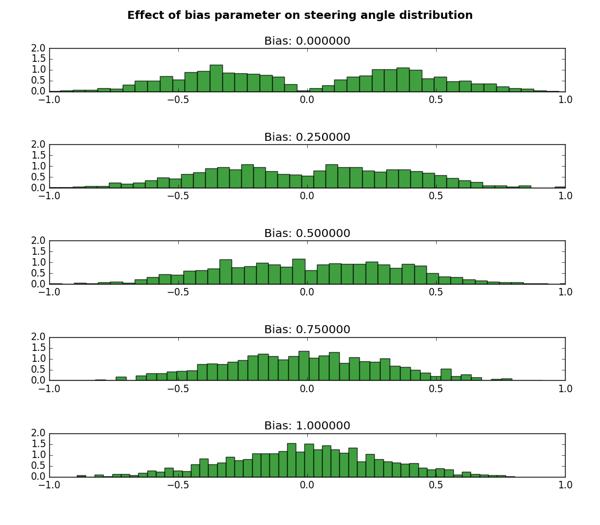

# Project 3 - Behavioral Cloning

#### Demo here:

## Goal
The goal of the project was to train a Deep Network to replicate the human steering behavior while driving, thus being able to drive autonomously on a simulator provided by [Udacity](https://www.udacity.com/). To this purpose, the network takes as input the frame of the frontal camera (say, a roof-mounted camera) and predicts the steering direction at each instant.

## The dataset
Data for this task can be gathered with the Udacity simulator itself. Indeed, when the simulator is set to *training mode*, the car is controlled by the human though the keyboard, and frames and steering directions are stored to disk. For those who want to avoid this process, Udacity made also available an "off-the-shelf" training set. For this project, I employed this latter.

Udacity training set is constituted by 8036 samples. For each sample, two main information are provided:
- three frames from the frontal, left and right camera respectively
- the corresponding steering direction

### Visualizing training data

Here's how a typical sample looks like. We have three frames from different cameras as well as the associated steering direction.

First things first, every frame is preprocessed by cropping the upper and lower part of the frame: in this way we discard information that is probably useless for the task of predicting the steering direction. Now our input frames look like these: 

As we see, each frame is associated to a certain steering angle. Unfortunately, there's a huge skew in the ground truth data distribution: as we can see the steering angle distribution is strongly biased towards the zero.

### Data Augmentation

Due to the aforementioned data imbalance, it's easy to imagine that every learning algorithm we would train on the raw data would just learn to predict the steering value 0. Furthermore, we can see that the "test" track is completely different from the "training" one form a visually point of view. Thus, a network naively trained on the first track would *hardly* generalize to the second one. Various forms of data augmentation can help us to deal with these problems.

##### Exploting left and right cameras

For each steering angle we have available three frames, captured from the frontal, left and right camera respectively. Frames from the side cameras can thus be employed to augment the training set, by appropriately correcting the ground truth steering angle. This way of augmenting the data is also reported in the [NVIDIA paper](https://arxiv.org/pdf/1604.07316v1.pdf).

##### Brightness changes

Before being fed to the network, each frame is converted to HSV and the Value channel is multiplied element-wise by a random value in a certain range. The wider the range, the more different will be on average the augmented frames from the original ones.  

##### Normal noise on the steering value

Given a certain frame, we have its associated steering direction. However, being steering direction a continuous value, we could argue that the one in the ground truth is not *necessarily* the only working steering direction. Given the same input frame, a slightly different steering value would probably work anyway. For this reason, during the training a light normal distributed noise is added to the ground truth value. In this way we create a little more variety in the data without completely twisting the original value. 

##### Shifting the bias

Finally, we introduced a parameter called $bias \in [0, 1]$ in the `data generator` to be able to mitigate the bias towards zero of the ground truth. Every time an example is loaded from the training set, a *soft* random theshold $r \in [0, 1]$ is computed. Then the example is discarded from the batch if $s_i + bias < r$. In this way, we can tweak the ground truth distribution of the data batches loaded. The effect of the bias parameter on the distribution of the ground truth in a batch of 1024 frames is shown below:

## Network architecture
### Model architecture
### Preventing overfitting
### Training Details

## Testing the model
### Discussion
